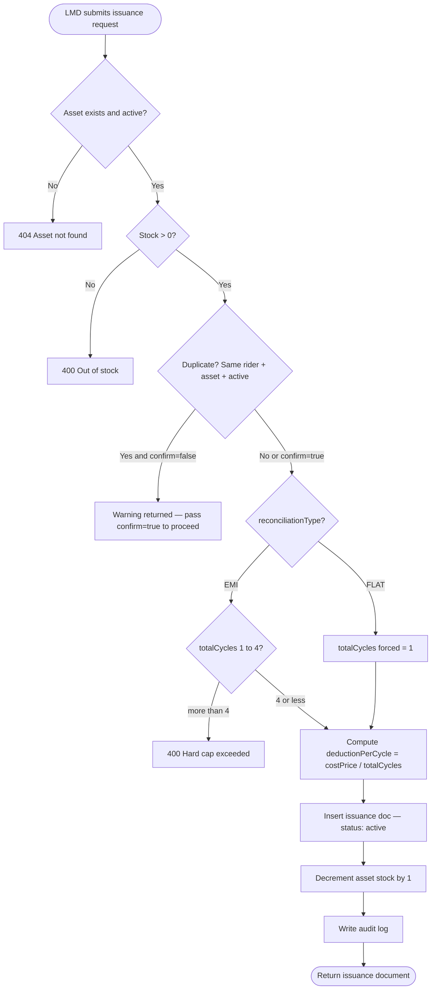
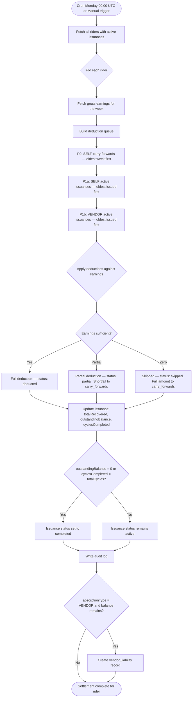
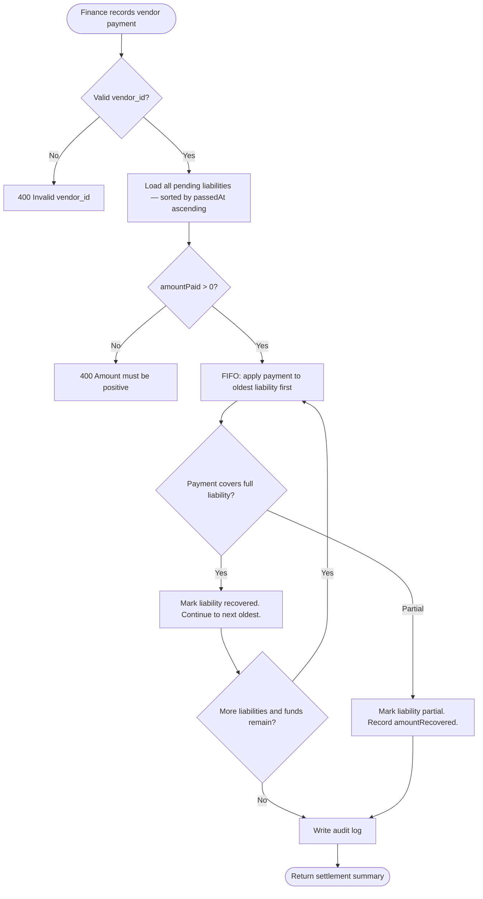
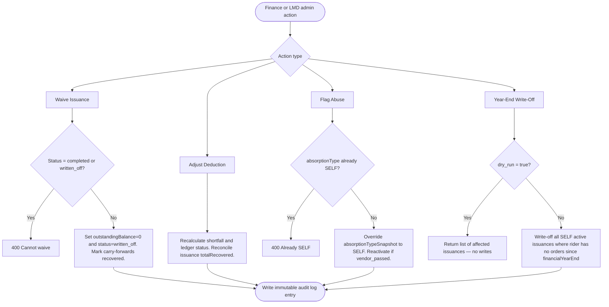

# 🏍️ Rider Asset Management System

> A production-grade FastAPI backend with a dark-theme admin frontend for managing asset issuance, weekly deduction settlement, vendor liability tracking, and financial audit trails for last-mile delivery riders.

---

## Table of Contents

1. [Overview](#overview)
2. [Key Features](#key-features)
3. [Tech Stack](#tech-stack)
4. [System Architecture](#system-architecture)
5. [Flow Diagrams](#flow-diagrams)
6. [Folder Structure](#folder-structure)
7. [Installation Guide](#installation-guide)
8. [Usage Guide](#usage-guide)
9. [API Documentation](#api-documentation)
10. [Database Schema](#database-schema)
11. [Configuration & Environment Variables](#configuration--environment-variables)
12. [Deployment Guide](#deployment-guide)
13. [Testing Instructions](#testing-instructions)
14. [Edge Cases & Limitations](#edge-cases--limitations)
15. [Performance Considerations](#performance-considerations)
16. [Security Considerations](#security-considerations)
17. [Future Improvements / Roadmap](#future-improvements--roadmap)
18. [Contributing Guidelines](#contributing-guidelines)
19. [License](#license)

---

## Overview

### Problem

Delivery platforms issue physical assets (delivery bags, phones, rain gear) to riders. Recovering the cost of these assets through weekly payroll deductions is operationally complex:

- Assets may be absorbed by the **vendor** (cost is vendor's liability) or **self** (rider bears the cost).
- Deductions must happen in a strict **priority order** so riders who owe the most critical debts are settled first.
- Vendors need reconciliation against what they owe vs. what they have paid.
- Finance teams need override controls: waive, adjust, flag abuse, year-end write-offs.
- Every financial action must produce an immutable **audit trail**.

### Solution

This system provides a fully async REST API that:

1. Manages the asset catalog with stock tracking.
2. Issues assets to riders with FLAT (single deduction) or EMI (up to 4-cycle spread) reconciliation.
3. Runs a **weekly settlement engine** every Monday that applies deductions from each rider's earnings according to a deterministic priority queue.
4. Tracks vendor liabilities and supports FIFO vendor payout recording.
5. Exposes admin overrides and a reports layer for full financial visibility.
6. Ships with a **no-framework admin frontend** for operations teams.

---

## Key Features

| Feature | Description |
|---|---|
| **Asset Catalog** | Create, update, soft-delete assets with stock management |
| **Smart Issuance** | FLAT / EMI reconciliation with duplicate detection |
| **Bulk Upload** | CSV-based bulk issuance via file upload |
| **Settlement Engine** | Priority-ordered weekly deduction processor (P0 → P1a → P1b) |
| **Carry-Forward** | Unpaid shortfalls automatically roll into next week |
| **Vendor Liability** | Per-vendor outstanding tracking with FIFO payout settlement |
| **Admin Overrides** | Waive balances, adjust deductions, flag abuse, year-end write-off |
| **Audit Trail** | Immutable log for every state-changing action |
| **Reports** | Settlement breakdown, vendor liability summary, entity audit history |
| **Rider View** | Rider-facing endpoint showing active assets and outstanding balances |
| **Frontend** | Dark-theme admin dashboard — no build tools required |
| **Full Test Suite** | 77 HTTP-level tests covering all flows and edge cases |

---

## Tech Stack

| Technology | Role | Why |
|---|---|---|
| **FastAPI** | HTTP framework | Async-native, auto-generates OpenAPI docs, Pydantic validation built-in |
| **Python 3.12** | Runtime | Latest stable; full `asyncio` support required by Motor |
| **MongoDB Atlas** | Database | Document model fits heterogeneous asset/issuance data; Atlas free tier works out of the box |
| **Motor** | Async MongoDB driver | Non-blocking I/O — critical for high-concurrency settlement runs |
| **Pydantic v2** | Data validation | Strict schema enforcement at API boundaries, zero boilerplate |
| **APScheduler** | Cron scheduler | Lightweight; triggers weekly settlement automatically every Monday 00:00 UTC |
| **Pandas** | CSV parsing (bulk upload) | Battle-tested CSV/DataFrame handling with graceful error reporting per row |
| **pytest + pytest-asyncio** | Test framework | Native async test support; `asyncio_mode=auto` removes per-test decorators |
| **httpx + ASGITransport** | HTTP-level testing | Tests the full request/response cycle without a live server |
| **Vanilla JS / HTML / CSS** | Admin frontend | Zero build toolchain — works by opening `index.html` directly in a browser |

---

## System Architecture

```
┌─────────────────────────────────────────────────────────────────┐
│                        Admin Frontend                           │
│         (frontend/index.html + styles.css + app.js)             │
│              Vanilla JS → fetch() → REST API                    │
└────────────────────────────┬────────────────────────────────────┘
                             │ HTTP/JSON
┌────────────────────────────▼────────────────────────────────────┐
│                      FastAPI Application                        │
│  ┌──────────┐ ┌───────────┐ ┌──────────┐ ┌──────────────────┐  │
│  │  /assets │ │/issuances │ │/settlement│ │/vendors /reports │  │
│  │  /rider  │ │  /admin   │ └──────────┘ │    /admin        │  │
│  └────┬─────┘ └─────┬─────┘             └────────┬─────────┘  │
│       │             │                            │             │
│  ┌────▼─────────────▼────────────────────────────▼──────────┐  │
│  │                    Service Layer                          │  │
│  │  SettlementEngine │ DeductionCalculator │ VendorService   │  │
│  │                        AuditService                       │  │
│  └────────────────────────┬──────────────────────────────────┘  │
│                           │ Motor async                         │
│  ┌────────────────────────▼──────────────────────────────────┐  │
│  │              MongoDB Atlas (async via Motor)               │  │
│  │  asset_master │ asset_issuances │ asset_deduction_ledger   │  │
│  │  vendor_liabilities │ rider_carry_forwards │ audit_logs    │  │
│  └───────────────────────────────────────────────────────────┘  │
│                                                                 │
│  ┌──────────────────────────────────────────────────────────┐   │
│  │  APScheduler — fires run_weekly_settlement every Monday  │   │
│  └──────────────────────────────────────────────────────────┘   │
└─────────────────────────────────────────────────────────────────┘
```

### Key Design Decisions

- **Async everywhere**: Every database call is `await`-ed through Motor. The settlement engine processes riders without blocking the event loop.
- **Dependency injection**: `get_db()` is injected via FastAPI `Depends()`, making the database trivially mockable in tests.
- **Snapshot fields**: Issuances store `costPriceSnapshot`, `absorptionTypeSnapshot`, and `vendorIdSnapshot` at issue time so future changes to the asset master do not retroactively affect deductions.
- **Soft deletes**: Assets are never hard-deleted — status is set to `inactive` to preserve referential integrity for historical issuances.

---

## Flow Diagrams

### 1. Asset Issuance Flow



### 2. Weekly Settlement Engine Flow



### 3. Vendor Liability Settlement Flow



### 4. Admin Override Flow



---

## Folder Structure

```
Assignment_fairdeal/
│
├── README.md                          # This file
├── TEST_CASES.txt                     # 105 documented test cases with inputs/outputs
│
├── frontend/                          # Admin UI — open index.html in browser
│   ├── index.html                     # Full HTML: sidebar, 9 sections, modal, toasts
│   ├── styles.css                     # Dark theme CSS, no framework
│   └── app.js                         # All API calls, navigation, form handlers
│
└── rider-asset-management/            # FastAPI backend
    ├── main.py                        # App entry point, lifespan, router registration
    ├── config.py                      # MongoDB connection, get_db() dependency
    ├── requirements.txt               # All Python dependencies
    ├── pytest.ini                     # asyncio_mode=auto, testpaths=tests
    │
    ├── models/                        # Pydantic request/response schemas
    │   ├── asset_master.py            # AssetMasterCreate, AssetMasterUpdate
    │   ├── issuance.py                # AssetIssuanceCreate, BulkIssuanceRow
    │   ├── vendor_liability.py        # VendorSettleRequest
    │   ├── audit_log.py               # AuditLogEntry schema
    │   └── deduction_ledger.py        # DeductionLedgerEntry schema
    │
    ├── routes/                        # FastAPI routers — one file per domain
    │   ├── assets.py                  # GET/POST/PATCH/DELETE /api/assets
    │   ├── issuances.py               # POST /api/issuances, bulk, replace
    │   ├── settlement.py              # POST /api/settlement/run-weekly
    │   ├── vendors.py                 # GET/POST /api/vendors/{id}/*
    │   ├── reports.py                 # GET /api/reports/*
    │   ├── admin.py                   # POST/PATCH /api/admin/*
    │   └── rider.py                   # GET /api/rider/{id}/assets
    │
    ├── services/                      # Business logic — no HTTP concerns here
    │   ├── settlement_engine.py       # SettlementEngine.run_weekly_settlement()
    │   ├── deduction_calculator.py    # Priority sort, deduction computation
    │   ├── vendor_service.py          # FIFO liability settlement, summary
    │   └── audit_service.py           # AuditService.log(), get_audit_trail()
    │
    ├── cron/
    │   └── weekly_settlement.py       # APScheduler job wired to SettlementEngine
    │
    └── tests/
        ├── test_api_endpoints.py      # 77 HTTP-level tests via AsyncClient
        ├── test_issuance_validation.py# Pydantic validation edge cases
        └── test_settlement_engine.py  # Settlement logic unit tests
```

---

## Installation Guide

### Prerequisites

| Requirement | Version | Check |
|---|---|---|
| Python | 3.12+ | `python --version` |
| pip | latest | `pip --version` |
| Git | any | `git --version` |
| MongoDB Atlas account | free tier | [mongodb.com/atlas](https://www.mongodb.com/atlas) |

### Step 1 — Clone the Repository

```bash
git clone https://github.com/Devanshyadv/Rider_Asset_management.git
cd Rider_Asset_management/rider-asset-management
```

### Step 2 — Create a Virtual Environment

```bash
python -m venv venv
```

Activate it:

```bash
# Windows
venv\Scripts\activate

# macOS / Linux
source venv/bin/activate
```

You should see `(venv)` prepended to your terminal prompt.

### Step 3 — Install Dependencies

```bash
pip install -r requirements.txt
```

<details>
<summary>Key packages installed</summary>

| Package | Purpose |
|---|---|
| `fastapi` | Web framework |
| `uvicorn[standard]` | ASGI server |
| `motor` | Async MongoDB driver |
| `pymongo` | Sync MongoDB utilities (ObjectId validation) |
| `pydantic` | Data validation |
| `apscheduler` | Cron scheduler |
| `pandas` | CSV parsing for bulk upload |
| `python-multipart` | File upload support |
| `python-dotenv` | `.env` file loader |
| `pytest` | Test runner |
| `pytest-asyncio` | Async test support |
| `httpx` | Async HTTP client for tests |

</details>

### Step 4 — Configure Environment Variables

Create a `.env` file inside `rider-asset-management/`:

```bash
MONGODB_URL=mongodb+srv://<username>:<password>@<cluster>.mongodb.net/?retryWrites=true&w=majority
```

**To get your MongoDB Atlas connection string:**
1. Log in at [cloud.mongodb.com](https://cloud.mongodb.com)
2. Click your cluster → **Connect** → **Drivers**
3. Copy the connection string and replace `<username>` and `<password>`

> ⚠️ Never commit your `.env` file. It is already excluded by `.gitignore`.

### Step 5 — Start the Server

```bash
uvicorn main:app --reload --port 8000
```

Expected output:

```
INFO:     Started server process [12345]
INFO:     Waiting for application startup.
INFO:     Connected to MongoDB Atlas
INFO:     Weekly settlement cron job scheduled (every Monday 00:00 UTC)
INFO:     Application startup complete.
INFO:     Uvicorn running on http://127.0.0.1:8000
```

### Step 6 — Open the Frontend

Open `frontend/index.html` in any browser — no web server required.

The sidebar displays **API Online** in green when the backend is reachable at `http://localhost:8000`.

---

## Usage Guide

### Interactive API Docs

FastAPI auto-generates interactive documentation at:

- **Swagger UI**: [http://localhost:8000/docs](http://localhost:8000/docs)
- **ReDoc**: [http://localhost:8000/redoc](http://localhost:8000/redoc)

### Example Workflows

#### Create an Asset

```bash
curl -X POST http://localhost:8000/api/assets \
  -H "Content-Type: application/json" \
  -d '{
    "name": "Delivery Bag",
    "costPrice": 1200.00,
    "absorptionType": "VENDOR",
    "vendorId": "64f1a2b3c4d5e6f7a8b9c0d1",
    "stock": 50
  }'
```

**Response:**
```json
{
  "_id": "64f1a2b3c4d5e6f7a8b9c0d2",
  "name": "Delivery Bag",
  "costPrice": 1200.0,
  "absorptionType": "VENDOR",
  "vendorId": "64f1a2b3c4d5e6f7a8b9c0d1",
  "stock": 50,
  "status": "active",
  "createdAt": "2026-03-22T10:00:00Z"
}
```

#### Issue an Asset to a Rider (EMI — 4 cycles)

```bash
curl -X POST http://localhost:8000/api/issuances \
  -H "Content-Type: application/json" \
  -d '{
    "riderId": "64f1a2b3c4d5e6f7a8b9c0d3",
    "assetId": "64f1a2b3c4d5e6f7a8b9c0d2",
    "reconciliationType": "EMI",
    "totalCycles": 4
  }'
```

**Response:**
```json
{
  "_id": "64f1a2b3c4d5e6f7a8b9c0d4",
  "riderId": "64f1a2b3c4d5e6f7a8b9c0d3",
  "assetId": "64f1a2b3c4d5e6f7a8b9c0d2",
  "reconciliationType": "EMI",
  "totalCycles": 4,
  "deductionPerCycle": 300.0,
  "outstandingBalance": 1200.0,
  "status": "active"
}
```

#### Run Weekly Settlement

```bash
curl -X POST http://localhost:8000/api/settlement/run-weekly \
  -H "Content-Type: application/json" \
  -d '{
    "weekStart": "2026-03-16T00:00:00Z",
    "weekEnd": "2026-03-22T23:59:59Z",
    "riderEarnings": {
      "64f1a2b3c4d5e6f7a8b9c0d3": 4500.00
    }
  }'
```

**Response:**
```json
{
  "weekCycle": "2026-W12",
  "ridersProcessed": 1,
  "totalDeducted": 300.0,
  "entriesCreated": 1
}
```

#### Upload Bulk Issuances via CSV

```bash
curl -X POST http://localhost:8000/api/issuances/bulk \
  -F "file=@issuances.csv"
```

**CSV format (`issuances.csv`):**
```csv
riderId,assetId,reconciliationType,totalCycles
64f1a2b3c4d5e6f7a8b9c0d3,64f1a2b3c4d5e6f7a8b9c0d2,FLAT,1
64f1a2b3c4d5e6f7a8b9c0d5,64f1a2b3c4d5e6f7a8b9c0d2,EMI,4
```

**Response:**
```json
{
  "processed": 2,
  "rejected": []
}
```

---

## API Documentation

### Base URL

```
http://localhost:8000
```

### Assets

| Method | Endpoint | Description |
|---|---|---|
| `GET` | `/api/assets` | List all assets. Optional `?status=active` or `?status=inactive` |
| `POST` | `/api/assets` | Create a new asset |
| `PATCH` | `/api/assets/{asset_id}` | Update stock, price, absorption type, or status |
| `DELETE` | `/api/assets/{asset_id}` | Soft-delete — sets status to `inactive` |

### Issuances

| Method | Endpoint | Description |
|---|---|---|
| `POST` | `/api/issuances` | Issue asset to rider. Add `?confirm=true` to bypass duplicate check |
| `GET` | `/api/issuances/{rider_id}` | All issuances for a rider. Optional `?status=active` |
| `POST` | `/api/issuances/bulk` | Upload CSV for bulk issuance (multipart/form-data) |
| `POST` | `/api/issuances/{issuance_id}/replace` | Replace active issuance. Required: `?mid_balance_action=waive_remaining` or `pass_to_vendor` |

### Settlement

| Method | Endpoint | Description |
|---|---|---|
| `POST` | `/api/settlement/run-weekly` | Trigger weekly settlement engine |
| `GET` | `/api/settlement/status/{week}` | Settlement status for a given week, e.g. `2026-W12` |

**Request body for `run-weekly`:**
```json
{
  "weekStart": "2026-03-16T00:00:00Z",
  "weekEnd":   "2026-03-22T23:59:59Z",
  "riderEarnings": {
    "<riderId>": 4500.00
  }
}
```

### Vendors

| Method | Endpoint | Description |
|---|---|---|
| `GET` | `/api/vendors/{vendor_id}/liabilities` | All outstanding liabilities for a vendor |
| `POST` | `/api/vendors/{vendor_id}/settle` | Record a vendor payment (FIFO applied) |

**Request body for settle:**
```json
{
  "amountPaid": 5000.00,
  "note": "March 2026 payout"
}
```

### Reports

| Method | Endpoint | Description |
|---|---|---|
| `GET` | `/api/reports/settlement/{week}` | Full settlement report with per-rider breakdown |
| `GET` | `/api/reports/vendor-liability` | All-vendor liability summary with totals |
| `GET` | `/api/reports/audit/{entity_id}` | Complete audit trail for any entity by its ID |

### Admin Overrides

| Method | Endpoint | Role | Description |
|---|---|---|---|
| `POST` | `/api/admin/waive/{issuance_id}` | Finance | Write off entire outstanding balance |
| `PATCH` | `/api/admin/deduction/{ledger_id}` | Finance | Manually correct a deduction amount |
| `POST` | `/api/admin/flag-abuse/{issuance_id}` | LMD | Override absorption type to SELF |
| `POST` | `/api/admin/year-end-writeoff` | Finance | Bulk write-off inactive SELF issuances |

**Waive request body:**
```json
{
  "reason": "Rider terminated — balance forgiven",
  "performed_by_user_id": "admin_001"
}
```

**Year-end write-off body:**
```json
{
  "financialYearEnd": "2026-03-31T00:00:00Z",
  "dry_run": true,
  "performed_by_user_id": "finance_admin"
}
```

### Rider View

| Method | Endpoint | Description |
|---|---|---|
| `GET` | `/api/rider/{rider_id}/assets` | Rider's active assets, outstanding balances, and cycle progress |

**Response:**
```json
{
  "riderId": "64f1a2b3c4d5e6f7a8b9c0d3",
  "assets": [
    {
      "issuanceId": "64f1a2b3c4d5e6f7a8b9c0d4",
      "name": "Delivery Bag",
      "outstandingBalance": 900.0,
      "deductionThisCycle": 300.0,
      "cyclesRemaining": 3,
      "totalCycles": 4,
      "cyclesCompleted": 1,
      "status": "active"
    }
  ],
  "totalOutstanding": 900.0
}
```

---

## Database Schema

All collections live inside the `db` database on MongoDB Atlas.

### `asset_master`

```json
{
  "_id":            "ObjectId",
  "name":           "string",
  "costPrice":      "float  (> 0)",
  "absorptionType": "VENDOR | SELF",
  "vendorId":       "ObjectId | null",
  "stock":          "int  (>= 0)",
  "status":         "active | inactive",
  "createdAt":      "datetime (UTC)",
  "updatedAt":      "datetime (UTC)"
}
```

### `asset_issuances`

```json
{
  "_id":                    "ObjectId",
  "riderId":                "ObjectId",
  "assetId":                "ObjectId",
  "issuedAt":               "datetime (UTC)",
  "reconciliationType":     "FLAT | EMI",
  "totalCycles":            "int  (1–4)",
  "cyclesCompleted":        "int",
  "costPriceSnapshot":      "float   frozen at issue time",
  "absorptionTypeSnapshot": "VENDOR | SELF   frozen at issue time",
  "vendorIdSnapshot":       "ObjectId | null   frozen at issue time",
  "deductionPerCycle":      "float",
  "totalRecovered":         "float",
  "outstandingBalance":     "float",
  "status":                 "active | completed | replaced | written_off | vendor_passed",
  "replacementCount":       "int",
  "replacementOf":          "ObjectId | null",
  "createdAt":              "datetime (UTC)"
}
```

### `asset_deduction_ledger`

```json
{
  "_id":             "ObjectId",
  "riderId":         "ObjectId",
  "issuanceId":      "ObjectId",
  "weekCycle":       "string   e.g. 2026-W12",
  "amountDue":       "float",
  "amountDeducted":  "float",
  "shortfall":       "float",
  "carriedForward":  "bool",
  "status":          "deducted | partial | skipped",
  "createdAt":       "datetime (UTC)",
  "updatedAt":       "datetime (UTC)"
}
```

### `vendor_liabilities`

```json
{
  "_id":               "ObjectId",
  "vendorId":          "ObjectId",
  "issuanceId":        "ObjectId",
  "riderId":           "ObjectId",
  "outstandingAmount": "float",
  "amountRecovered":   "float",
  "status":            "pending | partial | recovered",
  "passedAt":          "datetime (UTC)",
  "weekCycle":         "string",
  "createdAt":         "datetime (UTC)"
}
```

### `rider_carry_forwards`

```json
{
  "_id":                     "ObjectId",
  "riderId":                 "ObjectId",
  "issuanceId":              "ObjectId",
  "weekCycle":               "string",
  "outstandingCarryForward": "float",
  "status":                  "pending | recovered",
  "createdAt":               "datetime (UTC)",
  "updatedAt":               "datetime (UTC)"
}
```

### `asset_audit_logs`

```json
{
  "_id":                  "ObjectId",
  "entity_type":          "string   e.g. issuance, deduction",
  "entity_id":            "string",
  "action":               "issued | waived | replaced | written_off | vendor_passed | deducted",
  "performed_by":         "Finance | LMD | system",
  "performed_by_user_id": "string | null",
  "before_value":         "object | null",
  "after_value":          "object | null",
  "reason":               "string | null",
  "timestamp":            "datetime (UTC)"
}
```

### `orders`

```json
{
  "_id":       "ObjectId",
  "rider":     "ObjectId",
  "createdAt": "datetime (UTC)"
}
```

> Used exclusively by the year-end write-off endpoint to check whether a rider has placed any orders since the financial year end.

---

## Configuration & Environment Variables

| Variable | Required | Default | Description |
|---|---|---|---|
| `MONGODB_URL` | Yes | — | Full MongoDB Atlas connection string |
| `DATABASE_NAME` | No | `db` | MongoDB database name (set in `config.py`) |

To change the database name, edit `config.py`:

```python
DATABASE_NAME = "rider_assets_prod"
```

---

## Deployment Guide

### Local Development

```bash
cd rider-asset-management
source venv/bin/activate        # Windows: venv\Scripts\activate
uvicorn main:app --reload --port 8000
```

`--reload` enables hot-reload on file changes. Do **not** use in production.

### Production (Linux server)

#### Install Gunicorn

```bash
pip install gunicorn
```

#### Run with Gunicorn + Uvicorn workers

```bash
gunicorn main:app \
  --workers 4 \
  --worker-class uvicorn.workers.UvicornWorker \
  --bind 0.0.0.0:8000 \
  --access-logfile - \
  --error-logfile -
```

#### Run as a systemd service

```ini
# /etc/systemd/system/rider-assets.service
[Unit]
Description=Rider Asset Management API
After=network.target

[Service]
User=ubuntu
WorkingDirectory=/home/ubuntu/Rider_Asset_management/rider-asset-management
EnvironmentFile=/home/ubuntu/Rider_Asset_management/rider-asset-management/.env
ExecStart=/home/ubuntu/venv/bin/gunicorn main:app \
    --workers 4 \
    --worker-class uvicorn.workers.UvicornWorker \
    --bind 0.0.0.0:8000
Restart=always

[Install]
WantedBy=multi-user.target
```

```bash
sudo systemctl enable rider-assets
sudo systemctl start rider-assets
sudo systemctl status rider-assets
```

#### Nginx Reverse Proxy

```nginx
server {
    listen 80;
    server_name yourdomain.com;

    location / {
        proxy_pass http://127.0.0.1:8000;
        proxy_set_header Host $host;
        proxy_set_header X-Real-IP $remote_addr;
    }
}
```

### Docker

```dockerfile
FROM python:3.12-slim
WORKDIR /app
COPY requirements.txt .
RUN pip install --no-cache-dir -r requirements.txt
COPY . .
EXPOSE 8000
CMD ["uvicorn", "main:app", "--host", "0.0.0.0", "--port", "8000"]
```

```bash
docker build -t rider-assets .
docker run -p 8000:8000 --env-file .env rider-assets
```

---

## Testing Instructions

### Run All Tests

```bash
cd rider-asset-management
source venv/bin/activate
pytest
```

### Run with Verbose Output

```bash
pytest -v
```

### Run a Specific File

```bash
pytest tests/test_api_endpoints.py -v
pytest tests/test_settlement_engine.py -v
```

### Run a Specific Test Class or Method

```bash
pytest tests/test_api_endpoints.py::TestIssuanceCreate -v
pytest tests/test_api_endpoints.py::TestSettlement::test_run_weekly_success -v
```

### Expected Output

```
========================== test session starts ==========================
platform win32 -- Python 3.12.x, pytest-8.x, pluggy-1.x
asyncio_mode: auto
collected 77 items

tests/test_api_endpoints.py::TestRoot::test_root_ok PASSED          [  1%]
tests/test_api_endpoints.py::TestAssetCreate::test_create_valid PASSED [  2%]
...
tests/test_api_endpoints.py::TestRiderView::test_rider_no_assets PASSED [100%]

========================== 77 passed in 3.42s ==========================
```

### How Tests Work

Tests use **no live database**. Every MongoDB collection is mocked:

```python
# Async methods mocked
mock_db.asset_master.insert_one = AsyncMock(return_value=InsertOneResult(...))
mock_db.asset_master.find_one   = AsyncMock(return_value=asset_doc)

# Injected via FastAPI dependency override
app.dependency_overrides[get_db] = lambda: mock_db
```

The FastAPI `lifespan` (which connects to MongoDB on startup) is fully patched so tests run instantly without any network connection or Atlas account.

---

## Edge Cases & Limitations

| Scenario | Behaviour |
|---|---|
| Duplicate issuance — same rider, same asset, active | Returns a `warning` field. Must re-send with `?confirm=true` to proceed |
| `FLAT` reconciliation with `totalCycles > 1` | Rejected by Pydantic model validator with HTTP 422 |
| `totalCycles > 4` | Hard-blocked at both Pydantic and route level (double guard) |
| Settlement where rider earnings = 0 | All deductions skipped; full amounts written to carry-forwards |
| Replacing an issuance with `pass_to_vendor` but no vendor snapshot | HTTP 400 — `vendorIdSnapshot` is null |
| More than 2 replacements per rider per asset | HTTP 400 — replacement cap exceeded |
| Year-end write-off with `dry_run=true` | Preview only — zero database writes |
| Flagging abuse on a SELF issuance | HTTP 400 — absorption is already SELF |
| Deactivating an already-inactive asset | HTTP 400 returned |
| Invalid MongoDB ObjectId in any path parameter | HTTP 400 with message `Invalid <field_name>` |
| Waiving an issuance that is already completed or written off | HTTP 400 returned |

---

## Performance Considerations

- **Async I/O**: All routes and service methods are `async`. Motor never blocks the event loop during database operations.
- **Settlement at scale**: The engine fetches active issuances per rider in a single query. For platforms with more than 10,000 active riders, batch riders in groups of 500 per coroutine group.
- **Recommended MongoDB indexes for production:**

```javascript
db.asset_issuances.createIndex({ riderId: 1, status: 1 })
db.asset_issuances.createIndex({ assetId: 1, status: 1 })
db.asset_deduction_ledger.createIndex({ weekCycle: 1, riderId: 1 })
db.vendor_liabilities.createIndex({ vendorId: 1, status: 1, passedAt: 1 })
db.rider_carry_forwards.createIndex({ riderId: 1, status: 1 })
db.asset_audit_logs.createIndex({ entity_id: 1, timestamp: -1 })
db.orders.createIndex({ rider: 1, createdAt: -1 })
```

- **Bulk upload**: Rows are processed sequentially (not concurrently) to respect per-asset stock limits accurately. For CSVs larger than 1,000 rows, consider chunked async processing.

---

## Security Considerations

> This system is designed for **internal use** behind a trusted network. The following steps are recommended before any public exposure.

| Risk | Recommendation |
|---|---|
| No authentication | Add JWT or OAuth2 via `fastapi-users` or an API gateway |
| `.env` credentials | Already gitignored; use AWS Secrets Manager or HashiCorp Vault in production |
| Admin endpoints unprotected | Gate `/api/admin/*` behind a role-based middleware |
| CORS open | Set `allow_origins` to specific frontend domains in `CORSMiddleware` |
| No rate limiting | Add `slowapi` or Nginx rate limiting on settlement and bulk endpoints |
| Audit log tampering | Apply a MongoDB role that blocks updates and deletes on `asset_audit_logs` |

---

## Future Improvements / Roadmap

- [ ] **Authentication and RBAC** — JWT with Finance / LMD / Rider roles
- [ ] **Pagination** — `limit` and `cursor` on all list endpoints
- [ ] **Settlement dry-run mode** — preview deductions before committing to the database
- [ ] **WebSocket settlement feed** — real-time progress updates during large runs
- [ ] **Multi-currency support** — `currencyCode` field on assets and ledger entries
- [ ] **Rider mobile API** — stripped-down read-only endpoints for a rider app
- [ ] **Email / SMS notifications** — notify riders of weekly deduction summaries
- [ ] **Analytics dashboard** — settlement trends and vendor reconciliation charts
- [ ] **Rate limiting** — per-IP throttling on the settlement trigger endpoint
- [ ] **Docker Compose** — local dev setup with MongoDB replica set

---

## Contributing Guidelines

1. **Fork** the repository and create a feature branch:
   ```bash
   git checkout -b feature/my-feature
   ```

2. **Write tests** for any new endpoint or service method. All tests must pass:
   ```bash
   pytest -v
   ```

3. **Follow the existing code style:**
   - Async functions for all database operations
   - Pydantic models for all request bodies
   - Route handlers stay thin — business logic belongs in `services/`
   - Every state-changing action must call `AuditService.log()`

4. **Commit with a clear message:**
   ```bash
   git commit -m "feat(issuances): add partial-replacement cap override for admins"
   ```

5. **Open a Pull Request** with a description of the change and relevant test output.

---

## License

This project is released under the **MIT License**.

```
MIT License

Copyright (c) 2026 Devansh

Permission is hereby granted, free of charge, to any person obtaining a copy
of this software and associated documentation files (the "Software"), to deal
in the Software without restriction, including without limitation the rights
to use, copy, modify, merge, publish, distribute, sublicense, and/or sell
copies of the Software, and to permit persons to whom the Software is
furnished to do so, subject to the following conditions:

The above copyright notice and this permission notice shall be included in all
copies or substantial portions of the Software.

THE SOFTWARE IS PROVIDED "AS IS", WITHOUT WARRANTY OF ANY KIND, EXPRESS OR
IMPLIED, INCLUDING BUT NOT LIMITED TO THE WARRANTIES OF MERCHANTABILITY,
FITNESS FOR A PARTICULAR PURPOSE AND NONINFRINGEMENT. IN NO EVENT SHALL THE
AUTHORS OR COPYRIGHT HOLDERS BE LIABLE FOR ANY CLAIM, DAMAGES OR OTHER
LIABILITY, WHETHER IN AN ACTION OF CONTRACT, TORT OR OTHERWISE, ARISING FROM,
OUT OF OR IN CONNECTION WITH THE SOFTWARE OR THE USE OR OTHER DEALINGS IN
THE SOFTWARE.
```
